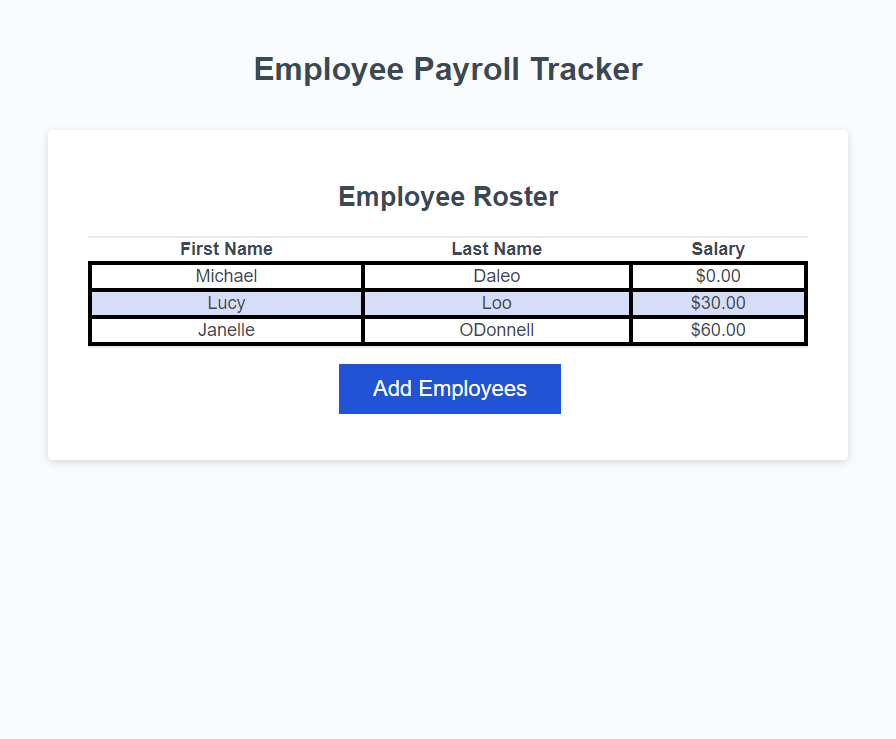

# Employee-Payroll-Tracker

## Description

An employee payroll tracker using JavaScript.

## Usage 

To enter employees' first name, last name and salary data onto a webpage.

## Credits

Starter code provided by Rutgers Coding Bootcamp.

## License 

Please refer to the LICENSE in the repo.